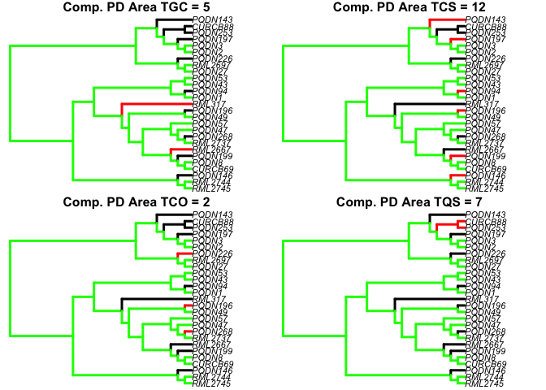
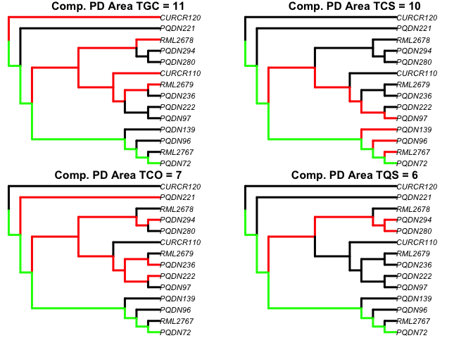
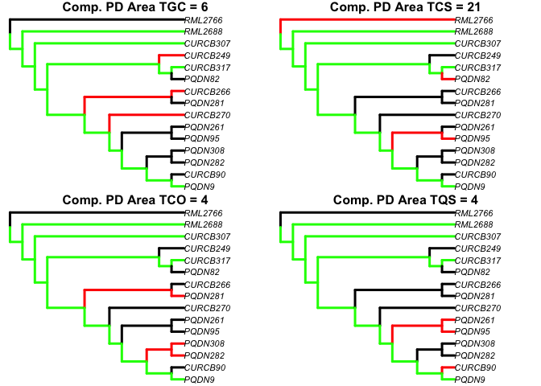
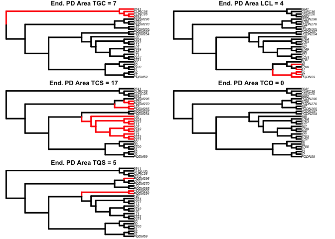

<!-- README.md is generated from README.Rmd. Please edit that file -->

# areaPD

<!-- badges: start -->
<!-- badges: end -->

The goal of areaPD is to calculate phylogenetic diversity (PD) for a set
of geographic areas, calculating complementarity PD given a selected
area, and constructing a Venn’s diagram of PD within and between areas,
given a phylogenetic tree and an assignment of samples (e.g., alleles,
species, etc.) to areas.

## Installation

You can install the released version of areaPD from
[CRAN](https://CRAN.R-project.org) with:

``` r
install.packages("areaPD")
```

And the development version from [GitHub](https://github.com/) with:

``` r
# install.packages("devtools")
devtools::install_github("arleyc/areaPD")
```

## Example

This is a basic example which shows you how to solve a common problem:

``` r
library(areaPD)
#PD calculation for a set of areas and a given phylogeny
data("homodata")
data("homotree")
homoPD<-multiareaPD(homodata,homotree)
```


``` r
data("limnodata")
data("limnotree")
limnoPD<-multiareaPD(limnodata,limnotree)
```


``` r
data("contodata")
data("contotree")
contoPD<-multiareaPD(contodata,contotree)
```


``` r
data("latidata")
data("latitree")
latiPD<-multiareaPD(latidata,latitree)
```


``` r
#complementary PD calculation for a set of areas given a phylogeny and
#a selected area (LCL)
homoPDcomp<-compareaPD(homodata,homotree,LCL)
```


``` r
limnoPDcomp<-compareaPD(limnodata,limnotree,LCL)
```



``` r
contoPDcomp<-compareaPD(contodata,contotree,LCL)
```



``` r
latiPDcomp<-compareaPD(latidata,latitree,LCL)
```



``` r
#drawing a Venn's diagram for a set of five areas given two
#different phylogenetic trees
vennout<-makeVennPD(list(homoPD,limnoPD,contoPD,latiPD))
```


