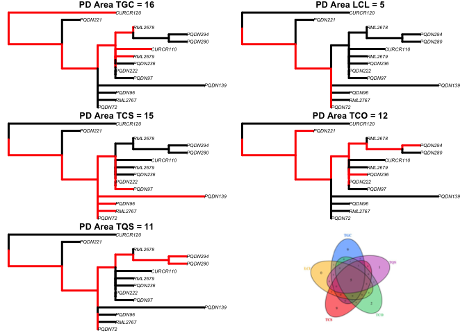

<!-- README.md is generated from README.Rmd. Please edit that file -->

# areaPD

<!-- badges: start -->
<!-- badges: end -->

The goal of areaPD is to calculate phylogenetic diversity (PD) for a set
of geographic areas, calculating endemism PD for the set of areas,
calculating complementarity PD given a selected area, and constructing a
Venn’s diagram of PD within and between areas, given one or more
phylogenetic trees and an assignment of samples (e.g., alleles, species,
etc.) to areas.

## Installation

You can install the development version from
[GitHub](https://github.com/) with:

``` r
# install.packages("devtools")
devtools::install_github("arleyc/areaPD")
```

## Example

``` r
library(areaPD)
#PD calculation for a set of areas and a given phylogeny
data("homodata")
data("homotree")
homoPD<-multiareaPD(homodata[1:5,],homotree)
```


``` r
limnoPD<-multiareaPD(limnodata[1:5,],limnotree)
```


``` r
contoPD<-multiareaPD(contodata[1:5,],contotree)
```



``` r
latiPD<-multiareaPD(latidata[1:5,],latitree)
```


``` r
#complementarity PD calculation for a set of areas given a phylogeny
#(in red) and a selected area (LCL, in green)
homoPDcomp<-compareaPD(homodata[1:5,],homotree,LCL)
```


``` r
#endemism PD calculation for a set of areas given a phylogeny
homoPDend<-endemismPD(homodata[1:5,],homotree)
```


``` r
#drawing a Venn's diagram for a set of five areas given four
#different phylogenetic trees
vennout<-makeVennPD(list(homoPD,limnoPD,contoPD,latiPD))
```


